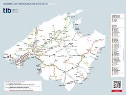
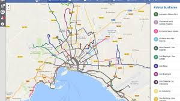

# Urlaub Mallorca

[unsplash](https://unsplash.com/photos/jJT1cnE4SZ8)

* 2 Wochen - 2 Orte
* [Reisehinweise](https://www./auswaertiges-amt.de/de/aussenpolitik/laender/spanien-node/spaniensicherheit/210534)
* Steckdosen Check: Typ c und F, 230/50Hz -> kein Adapter

## To-Do

* Koffer kaufen
* Spanisch lernen, wirklich!
* Vorfreude!

## Flüge

* **Hinflug**: STR -> PMI, 05. Sep. 13:37
* **Rückflug**: PMI -> STR, 19. Sep. 13:37

## Unterkunft

* **Airbnb Palma**
  * 05.09 - 12.09
  * 80€ / Nacht
* **Airbnb Manacor**
  * 12.09 - 19.09
  * 90€ / Nacht

Gesamt: **1190€**

## Verkehrsmittel

#### Öffentliche Verkehrsmittel

 * [TIB:](https://www.mallorca.es/de/bus) Bus, Bahn, Metro über ganze Insel

 * [EMT:](https://www.mallorcazeitung.es/mobilitat/2016/11/03/palmas-buslinien-fahrplaene-und-tarife-54166745.html
) Bus Großraum Palma

### Fahrrad
* [https://www.mallorca.com/de/aktivitaeten/mallorca-fahrradverleih](https://www.mallorca.com/de/aktivitaeten/mallorca-fahrradverleih)
* [https://radverleih-mallorca.com/anbieter/](https://radverleih-mallorca.com/anbieter/)

 

## Reiseplan

* **Palma**
  * Stadt erkunden
  * Catedral de Mallorca
  * Alcudia Old Town und Cap de Formentor (Norden)
  * Serra de Tramuntana (Westen)
  * Strand
* **Manacor**
  * Stadt erkunden
  * Fahrrad: Via Verde Manacor-Arta
  * Cuevas de Arta
  * Cala Domingos
  * Castell de Capdepera

