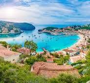

# Urlaub Mallorca

[unsplash](https://unsplash.com/photos/jJT1cnE4SZ8)

* 2 Wochen - 2 Orte
* [Reisehinweise](https://www./auswaertiges-amt.de/de/aussenpolitik/laender/spanien-node/spaniensicherheit/210534)
* Steckdosen Check: Typ c und F, 230/50Hz -> kein Adapter

## To-Do

* Reiseversicherung
* Koffer
* Spanisch lernen
* Vorfreude!

## Flüge

* **Hinflug**: STR -> PMI, 05. Sep. 13:37
* **Rückflug**: PMI -> STR, 19. Sep. 13:37

## Unterkunft

* **Hotel Palma**
  * 05.09 - 12.09
  * 140€ / Nacht
* **Hotel Manacor**
  * 12.09 - 19.09
  * 120€ / Nacht

Gesamt: **1820€**

## Verkehrsmittel

## Reiseplan
