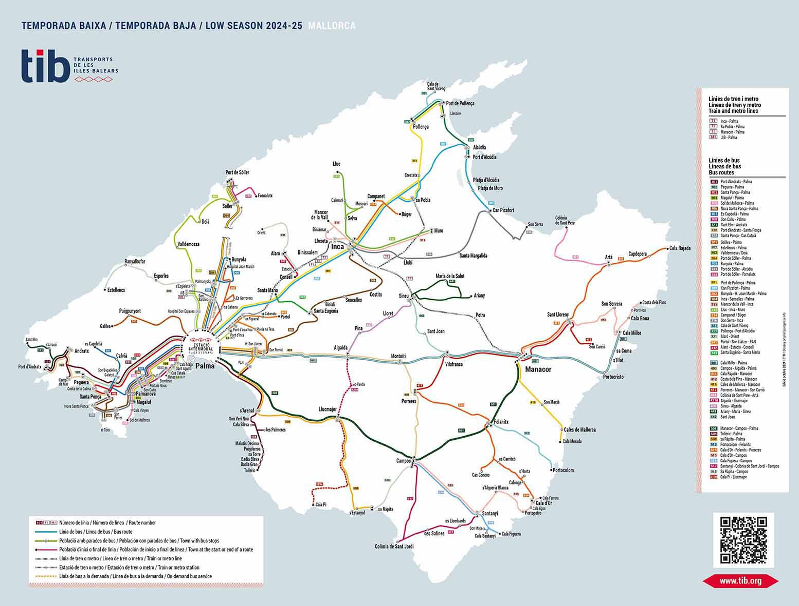
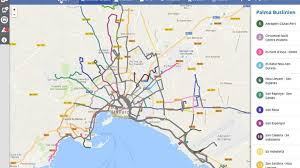

# Urlaub Mallorca

<small>[unsplash](https://www.google.com/url?sa=t&source=web&rct=j&opi=89978449&url=https://www.traum-ferienwohnungen.de/urlaubsmagazin/uebernachten-mallorca-regionen/&ved=2ahUKEwjntcLg2beOAxVpUMMIHYFIAGAQh-wKegQIIxAD&usg=AOvVaw2jjF6sGq3oq-Q4Y5W8nviY)</small>

* 2 Wochen - 2 Orte
* [Reisehinweise](https://www.google.com/url?sa=t&source=web&rct=j&opi=89978449&url=https://www.auswaertiges-amt.de/de/reiseundsicherheit/spaniensicherheit-210534&ved=2ahUKEwicu5TZ27eOAxUEcvEDHZcVLgAQFnoECCMQAQ&usg=AOvVaw2758TqVWIxD00wsdxXLXTo)
* Steckdosen Check: Typ C und F: 230V/50Hz -> kein Adapter

 ## To-Do
  * Koffer kaufen
  * Spanisch lernen, wirklich!
  * Vorfreude!

 ## Flüge
* **Hinflug**: STR -> PMI, 05. Sep. 13:37
* **Rückflug**: PMI -> STR, 19. Sep. 13:37

## Unterkunft
* **Airbnb Palma**:
    * 05.09 - 12.09
    * 80€ / Nacht
* **Airbnb Manacor**:
    * 05.09 - 19.09
    * 90€ / Nacht

Gesamt: **1190€**

## Verkehrsmittel
**Öffentliche Verkehrsmittel**
   * [TIB:](https://www.tib.org/de/xarxa-de-transports/mapa-linies) Bus, Bahn, Metro über ganze Insel
   
    
    
   * [EMT:](https://www.emtpalma.cat/de/linien/) Bus Großraum Palma
    
   
    
    

**Fahrrad**
   * **https://mallorca.com/de/aktivitaeten/sport/radfahren/mallorca-fahrradverleih**
   * **https://radverleih-mallorca.com/**

**Auto**
   * **https://www.mallorca.com/de/urlaub/mobil-auf-mallorca**

 
 

## Reiseplan
* **Palma**:
    * Stadt erkunden
    * Catedral de Mallorca
    * Alcudia Old Town und Cap de Formentor (Norden)
    * Serra de Tramuntana (Westen)
    * Strand
* **Manacor**:
    * Stadt erkunden
    * Fahrrad: Via Verde Manacor-Arta
    * Cuevas de Arta
    * Cala Domingos
    * Castell de Capdepera

